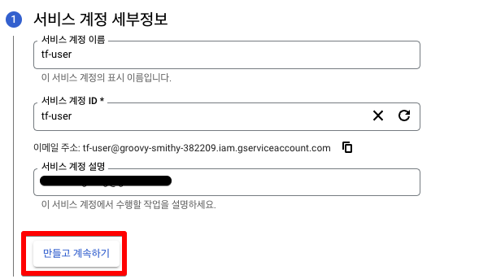
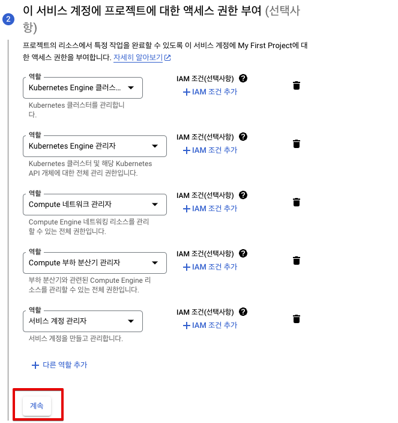
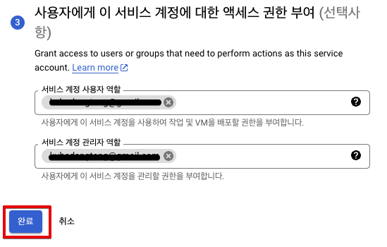

# Create GKE on GCP with Terraform


## 1. Terraform 설치하기

### 1.1  MacOS 설치 하기

```bash
brew install hashicorp/tap/terraform
```


### 1.2 Windows 설치 하기

- Chocolatey 설치

```cmd
Set-ExecutionPolicy Bypass -Scope Process -Force; [System.Net.ServicePointManager]::SecurityProtocol = [System.Net.ServicePointManager]::SecurityProtocol -bor 3072; iex ((New-Object System.Net.WebClient).DownloadString('https://community.chocolatey.org/install.ps1'))
```

- Terrafrom 설치

```cmd
choco install terraform
```


## 2. Kubectl 설치 하기

### 2.1 MacOS 설치 하기

```bash
# 설치 하기
brew install kubectl
or
brew install kubernetes-cli

# 테스트 하기
kubectl version --client
```


### 2.2 Windows 설치 하기

```cmd
# 설치 하기
choco install kubernetes-cli

# 테스트 하기
kubectl version --client
```


## 3. Google-cloud-sdk 설치 하기

### 3.1 Python 설치 하기

Google SDK 는 Python  3.5 ~ 3.9 가 설치 되어 있어야 합니다. 아래 명령어로 Python 이 설치 되지 않았다면 설치를 진행 합니다. 

- Python 버전 확인하기

``` bash
python -V
python3 -V
```


- MacOS Python 설치


- Windows Python 설치


### 3.1 Google-cloud-sdk 설치 하기 (MacOS)

- 설치 파일 다운로드 : [다운로드](https://cloud.google.com/sdk/docs/install-sdk?hl=ko#mac)

```bash
tar -zxvf ./google-cloud-cli-422.0.0-darwin-x86_64.tar.gz

./google-cloud-sdk/install.sh


Modify profile to update your $PATH and enable shell command completion?

Do you want to continue (Y/n)?  Y

The Google Cloud SDK installer will now prompt you to update an rc file to bring the Google Cloud CLIs into your environment.

Enter a path to an rc file to update, or leave blank to use [/Users/hbyun/.zshrc]:
Backing up [/Users/hbyun/.zshrc] to [/Users/hbyun/.zshrc.backup].
[/Users/hbyun/.zshrc] has been updated.

==> Start a new shell for the changes to take effect.


Google Cloud CLI works best with Python 3.7 and certain modules.

Python 3.7 installation detected, install recommended modules? (Y/n)?  Y

Setting up virtual environment
Updating modules...
     |████████████████████████████████| 2.5 MB 11.6 MB/s
     |████████████████████████████████| 55 kB 12.1 MB/s
Modules updated.

```


### 3.2 Google-cloud-sdk 설치 하기 (Windows)

- 파워쉘을 열고 아래 명령어를 실행 합니다.

```cmd
(New-Object Net.WebClient).DownloadFile("https://dl.google.com/dl/cloudsdk/channels/rapid/GoogleCloudSDKInstaller.exe", "$env:Temp\GoogleCloudSDKInstaller.exe") & $env:Temp\GoogleCloudSDKInstaller.exe
```

- gcloud 초기화

```cmd
gcloud init

To continue, you must log in. Would you like to log in (Y/n)? Y
```


## 4. GCP 설정하기

### 4.1 서비스 계정 만들기

IAM 관리자 → 서비스 계정 → 서비스 계정 만들기 를 클릭 합니다.




### 4.2 Access 권한 부여

아래와 같이 서비스 계정에 엑세스 권한을 부여 합니다.


| 역할 목록                         | 비고 |
| --------------------------------- | ---- |
| Kubernetes Engine 클러스터 관리자 |      |
| Kubernetes Engine 관리자          |      |
| Compute 네트워크 관리자           |      |
| Compute 부하 분산기 관리자        |      |
| 서비스 계정 관리자                |      |





### 4.3 IAM 사용자와 서비스 계정 연결하기




## 5. Terraform 

### 5.1 Git Clone

```zsh
git clone https://github.com/dangtong76/gke-clusters.git
```


### 5.2 tfvars 수정

dev-gke.tfvars 를 자신의 환경에 맞게 내용을 바꿔 줍니다.

```tex
project_id = "<your project id>"
region = "<your region>"
ip_cidr_range = "<CIDR Range>" #10.111.0.0/16
```


### 5.1 Workspace 생성

```
# Workspace 생성
terraform workspace new dev-gke

# Workspace 조회
terraform workspace list

```


### 5.4 클러스터 생성

```
terraform workspace select dev-gke

terraform plan -var-file=dev-gke.tfvars 

terraform apply -var-file=dev-gke.tfvars
```

